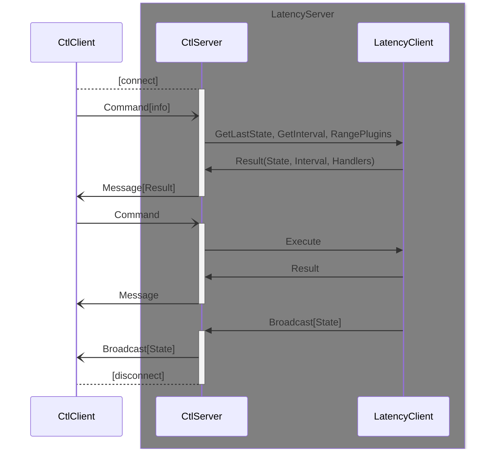

# LatencyTool

> **基于 *瞻鑫* 的延迟 获取 / 发布 / 监测系统**
> 
> C/S 架构
> 
> 服务端通过可热拔插的插件系统支持发布优选到多个交易柜台
> 
> 客户端支持一次性命令运行，同时支持 TUI 字符图形界面进行长时间监控

## 系统架构

### 控制台生命周期时序

### 控制台通信模式

> 通信模式通过连接字串标识，格式为：协议://连接定义
>
> **IPC通信：**ipc://ipc名称，**服务端**启动时，如未定义协议头，默认采用IPC通信
>
> **TCP通信：**tcp://ip:port，**客户端**存在一种基于`ssh`隧道转发的特殊TCP通信模式，协议头为 **ssh+tcp://**

无论控制台服务端还是终端，均使用相同的连接字串格式，区别在于指定连接字符串的参数

#### IPC 通信

> **IPC** 是服务器本地通信的一种方式，不支持跨服务器通信
> 
> 本工具的 **IPC** 通信管道，在 **Linux** 环境下使用 **unix sock** 
> **Windows** 环境下使用 **Named Pipe** 

该模式仅用于控制台的客户端和服务端运行于同一台服务器的场景，不支持跨服务器通信

且IPC通信仅支持一对连接，不支持多客户端接入，建议用于登录服务器后的临时通信

#### TCP 通信

> **TCP** 的通信过程不加密，要保障通信安全，建议使用 `ssh` 端口转发模式，通过 `ssh` 加密保障通信内容安全
> 
> 本工具的控制台客户端已实现了 `ssh` 转发模式，可直接使用，无需额外隧道配置

该模式支持控制台一对多连接，且支持跨服务器通信

由于通信协议采用明文 `JSON`，且连接无登录校验，**不建议**直接侦听全局IP，而仅侦听**127.0.0.1**

如需远程连接控制台的服务端口，可采用客户端的`ssh`隧道模式，步骤如下：

1. 控制台服务端侦听本地端口：`--ctl tcp://127.0.0.1:45678`

2. 控制台客户端通过`ssh`端口转发连接：

   `--conn ssh+tcp://{username}:{password}@{server_ip}[:{port}]?{conn}`

   - `username`： 控制台服务端所在服务器的系统账号，不可使用带 **:** 的账号，冒号作为分隔符，无论使用何种形式的密码，均必须存在
   - `password`：控制台服务端所在服务器的登录密码，如本地服务器和远端服务器已建立了证书互信，密码部分可为空，如SSH互信证书不在默认位置，可使用`key={key_file_path}`的格式代替密码部分
   - `server_ip`：控制台服务端所在服务器的连接地址
   - `port`：可选，如 `ssh` 端口为非默认端口，需要指定
   - `conn`：控制台服务端侦听的TCP地址端口，即实际侦听标识符除协议头外的部分

## 全局参数

> 全局参数可在任意命令下使用，且保持参数含义一致

### 日志相关参数

- `--log`  指定落地日志文件路径，默认：不输出日志文件
- `--size`  指定落地日志滚动大小（单位M），默认：300M
- `--keep`  指定保留几个滚动文件，默认：5个

### 瞻鑫相关参数

- `--schema`  瞻鑫系统连接协议，默认：http
- `--host`  瞻鑫系统连接地址，默认：10.36.51.124
- `--port`  瞻鑫系统连接端口，默认：9200

### 运行相关参数

- `--sink`  指定延迟结果保存文件路径，用于冷启动时提供默认值，默认：不保存
- `--interval`  指定延迟查询间隔（支持单位： h，m，s），间隔为0则一次性运行，默认：0
- `--before`  指定查询时间过滤范围，基于当前时间前的周期
- `--range`  指定查询时间过滤范围，基于起止时间，该参数将默认设定 `interval` 为0
- `--from`  指定Tick2Order延迟过滤范围左边界（单位：皮秒），默认：0
- `--to`  指定Tick2Order延迟过滤范围右边界（单位：皮秒），默认：100000000（100 us）
- `--percents`  指定聚合查询百分比列表，中值50必须包含，默认：[10, 25, 50, 75, 90]
- `--agg`  指定聚合结果记录数，默认：15
- `--least`  指定聚合查询需要的记录数，少于该值不进行聚合，默认：5
- `--user`  指定查询需要过滤的用户交易编码，可重复使用指定多个，默认：不进行过滤
- `--sort`  指定查询最终排序算法，可用参数params.[mid|avg|stdev|sample_stdev]，支持四则运算
- `--ctl`  指定控制台服务启动参数，可重复使用指定多个，默认：不启动控制台服务

### 帮助相关参数

- `--verbose`, `-v`  定义日志打印级别，不指定默认Info
- `--help`, `-h`  打印命令帮助文档
- `--version`  打印工具版本信息

## 无子命令运行

> 不指定子命令，将以控制台客户端模式运行

- `--conn`  指定控制台服务连接参数，可用参数详见通信模式
- `--tui`  指定控制台终端以字符图形化模式运行，可在命令输入框中使用 `help` 显示可用命令，同时支持 `help {cmd_name}` 打印命令详细参数
- `--cmd`  指定一次性运行的命令名，支持除 `--sink` 外全部运行相关参数

## `report` 子命令

> 启动指定插件的服务端，可通过控制台服务热插拔已加载插件

- `--lib`  指定插件库所在的基本目录
- `--plugin`  指定插件名，插件的动态库将从 *${lib}/${plugin}/${plugin}.extension* 载入
- `--config`  指定插件需要的配置文件路径，格式为：${plugin}=*${cfg_path}*
- `--interval`  同全局参数，此处使用默认值 1m 覆盖全局默认值
- `--once`  指定一次性运行命令，与`interval` 互斥且有更高优先级，等同 `--interval 0`

## `watch` 子命令

> 启动无插件的服务端，可通过控制台服务热插拔已加载插件

- `--interval`  同全局参数，此处使用默认值 1m 覆盖全局默认值
- `--once`  指定一次性运行命令，与`interval` 互斥且有更高优先级，等同 `--interval 0`
- `--data`  指定返回非聚合原始数据记录数，默认： 0
